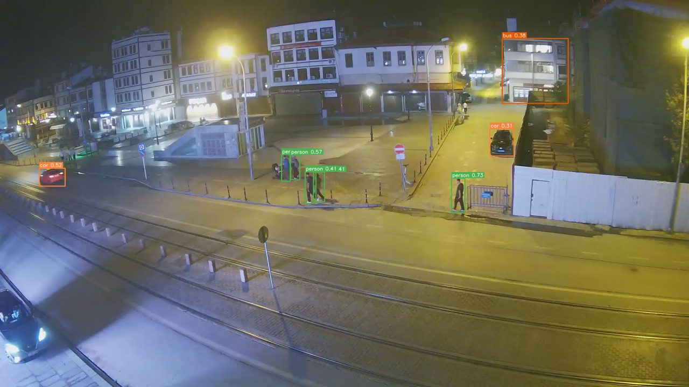
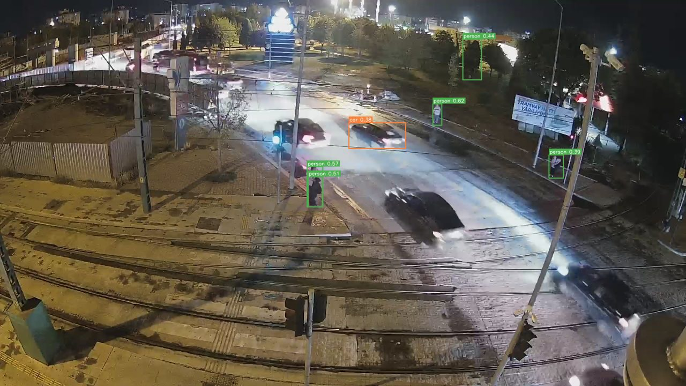
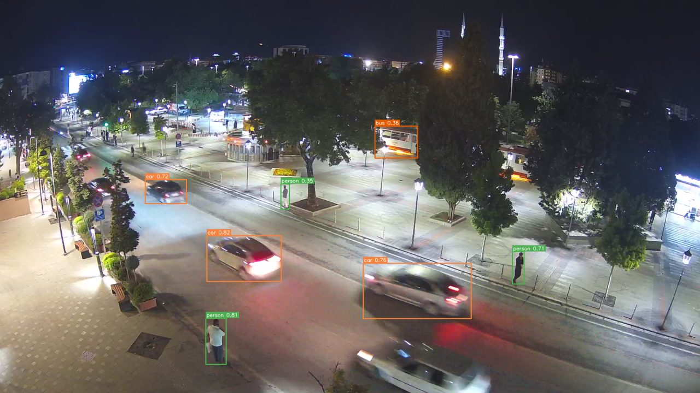
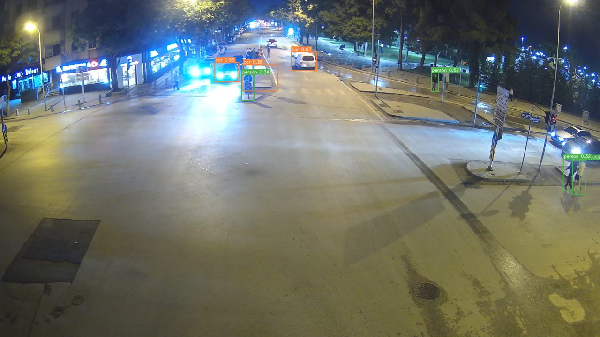

# Turkey Business Activity - Live YOLOv8 Crowd Detection

Turn public live-stream cameras in Turkey into quantitative time series:

> **live HLS stream → YOLOv8 frame inference → counts + appearance re-ID → Firestore →
> real-time web dashboard + Jupyter analytics.**

The project samples a handful of street / market / square cameras every sampling
round (40 s in the shipped cloud deployment; `--interval` sets it), runs YOLOv8 on
each frame, writes the counts and a per-detection appearance signature to
Firestore, and pushes the result to a browser dashboard via `onSnapshot` - no polling,
no refresh, everything updates the moment the collector posts a new sample. The
video tiles are (near-)live streams while the numbers describe the most recent
sample, so each tile also shows the age of its counts ("counts from 38s ago") -
if that label goes red the collector is not keeping up and the numbers should
not be trusted as "now".


> All source, configs and the notebook live in [`src/`](src/). The repo root only carries this `README.md` and the gitignore so the GitHub landing page stays clean.

---

## What the model sees

Live frames from the four grid cameras, annotated by the exact pipeline the
collector runs (`yolov8n`, `imgsz 512` on the shipped systemd unit,
`conf 0.30`): green boxes are people, orange are
vehicles, magenta is a train, each with its confidence. The dashboard shows
this view live under every tile ("Model view"), refreshed with every sample —
including night scenes like these, where detection is hardest.

| Konya - Hükümet Meydanı | Konya - Otogar Kavşağı |
|---|---|
|  |  |
| **Konya - Kültürpark** | **Konya - Millet Caddesi** |
|  |  |

---

## What the program does, end to end

```
 ┌───────────────────────┐    ┌────────────────────────┐    ┌────────────────────┐
 │  Live cameras         │    │  Cloud collector       │    │  Firebase          │
 │  (TR: IBB + Konya;    │ ─► │  GCP e2-micro VM       │ ─► │  Firestore (24h TTL)│
 │   TH/JP/US: YouTube)  │    │  • country ladder grid │    │   footfall/{auto}   │
 │                       │    │  • YOLOv8n predict     │    │   latest/{slot_id}  │
 │                       │    │  • appearance re-ID    │    │   reid_stats/{slot} │
 │                       │    │  • anomaly gates       │    │   config/grid       │
 │                       │    │  • Storage snapshots   │    │  Storage (24h)      │
 └───────────────────────┘    └────────────────────────┘    └──────────┬─────────┘
                                                                       │ onSnapshot
                                                                       ▼
                                           ┌────────────────────────────────────────┐
                                           │  web/  static HTML dashboard            │
                                           │  • 4-slot grid with active-cam badge   │
                                           │  • per-tile mini chart + anomaly       │
                                           │  • combined 24 h chart                  │
                                           │  • re-ID summary table                  │
                                           └────────────────────────────────────────┘
```

The two halves are decoupled. The collector runs 24/7 on a GCP `e2-micro`
on the Always Free tier ($0/month); the deploy README documents its
measured memory sizing. The
dashboard is plain HTML/JS — anyone can serve `web/` and
subscribe to the live data. Because the state lives in Firestore, every visitor
sees the accumulated history, and Firestore's TTL policy prunes the last 24h to
keep the DB small. Anomaly / returning-visitor snapshots go to Firebase Storage
(also 24h lifecycle).

The grid is **country-generic**. It always runs **4 cameras from ONE country**
and rotates through a country priority ladder — **Turkey → Thailand → Japan →
USA** — falling through to the next country only when the active one goes fully
dark. Turkey is the project's subject (Istanbul IBB first, then Konya); since
IBB is geo-blocked from Google Cloud, from the VM the grid usually falls
through to the foreign benches (YouTube-Live-backed street/traffic cameras that
are not geo-blocked) until Turkey's block lifts. A few minutes before each
daily report the collector re-probes higher-priority countries so Turkey
reclaims the grid the moment it comes back.

Inside a country, a `CameraPool` walks that country's own ladder: every round
runs the first 4 healthy cameras (always distinct), a camera that misses 3
samples in a row rests 15 min and the grid backfills from deeper in the SAME
country's bench, and `tvkur` (Konya) cameras are low-risk fast-fail probes that
rest after a single miss. A `HostBreaker` rests a whole host for 20 min after 4
consecutive access refusals (HTTP 403/429) and reopens it with a single probe —
so a blocking CDN is knocked ~3 times an hour, not ~120. Each assignment change
updates `config/grid` (with the active `country`) — the dashboard re-renders
that tile with the new active cam.

Report fields follow the live country and camera: the hour-of-week baseline and
the day/night gate use each **camera's** timezone (the US bench alone spans
Eastern, Central and Pacific).

---

## Quick start

The project ships zero-config for **viewers** — the Firebase Web SDK identifier
is committed, Firestore Rules make the four public collections read-only, the
cloud collector is running, and the dashboard just lights up.

```bash
# Anyone who clones the repo
pip install -r src/requirements.txt
jupyter lab turkey_business_activity.ipynb   # notebook lives at the repo root;
                                             # imports find app/ under src/ automatically
# or just the dashboard (no notebook, no analysis):
cd src && python serve.py                    # opens http://localhost:8000 with live counts
```

Cloud deployment (for the maintainer only, requires a Firebase Admin
service-account key) lives in [`src/deploy/gcp-vm/`](src/deploy/gcp-vm/README.md).

`serve.py` is a small no-cache static server that binds `web/` on port 8000 (override
with `--port`, suppress the browser pop with `--no-browser`, auto-falls-back to the
next free port if 8000 is busy).

Firebase project/service-account setup and security rules:
see [`docs/firebase_setup.md`](src/docs/firebase_setup.md).

---

## What the model predicts

**Two detectors, one pipeline.** The 24/7 cloud collector runs **`yolov8n`**
(nano) at `imgsz 512`, pinned in the shipped systemd unit
([`--weights yolov8n.pt`](src/deploy/gcp-vm/collector.service)) - it is the
heaviest model that fits the e2-micro's 1 GB budget without OOM. The **local
notebook** (`turkey_business_activity.ipynb`) instead loads **`yolo26m`**
(YOLO26, medium - the 2026 generation, NMS-free), the strong accuracy
reference: on one live frame nano found 2 people / 9 vehicles while YOLO26-m
found 12 people, 19 vehicles and 5 motorcycles nano missed. Change either via
`MODEL_WEIGHTS` (notebook) or `--weights` (collector); `ultralytics`
auto-downloads the weights on first use.

Each call returns boxes + class ids + confidences for the **COCO classes the project
cares about** ([`CLASSES_OF_INTEREST`](src/app/detect_core.py:18)):

| COCO id | name        | role                                       |
|:-------:|-------------|--------------------------------------------|
| 0       | `person`    | the primary footfall signal                |
| 1       | `bicycle`   | vehicle bucket                             |
| 2       | `car`       | vehicle bucket                             |
| 3       | `motorcycle`| vehicle bucket                             |
| 5       | `bus`       | vehicle bucket                             |
| 6       | `train`     | rail traffic (separate bucket, not summed into vehicles) |
| 7       | `truck`     | vehicle bucket                             |

`detect_with_boxes(frame, conf, imgsz)` returns:

```python
counts = {
    "person": 23, "car": 4, "bus": 0, "truck": 1,
    "bicycle": 0, "motorcycle": 2, "train": 0,
    "vehicles": 7,   # sum of the ROAD vehicle classes (train is separate)
}
boxes = [{"x1":…, "y1":…, "x2":…, "y2":…, "cls":"person", "conf":0.71}, …]
```

**Burst-median sampling.** A single frame is a noisy estimator - a pedestrian
occluded for a moment, or a car at the edge of the confidence band, flips the
count between consecutive frames. Each sampling round therefore grabs a short
burst (default 3 frames ~1 s apart), detects on every frame, and keeps the
**median** count per class ([`grab_burst` / `detect_burst`](src/app/detect_core.py)).
Re-ID and snapshots use the frame whose count matches the median, so images and
numbers stay consistent. The raw per-frame series is kept on each doc (`burst`)
for transparency.

**Input size + confidence.** The `detect_core.DEFAULT_IMGSZ` is `960` (the
notebook + local runs use it) because these wide street shots shrink a
distant pedestrian or car to a few pixels, and at 640 the model undercounts.
The shipped systemd unit for the Always Free e2-micro (1 GB) pins
`--imgsz 512` instead - not for accuracy but for RSS: even yolov8n at 960
would overshoot the host's memory once the OSNet re-ID embedder is loaded.
Raise `--imgsz` on any host with more RAM
(e2-small = 2 GB and up) to recover the last ~10-15% of distant-object
recall. Default confidence is `--conf 0.30`, with per-class overrides in
[`DEFAULT_PER_CLASS_CONF`](src/app/detect_core.py) - `person` is 0.35 to
stop the low-confidence "traffic sign labeled as person" mis-fires. Any
camera can carry its own calibrated `"conf"` override in
[`cameras.py`](src/app/cameras.py); notebook section 10 measures MAE/bias
per camera and per input size against your own manual counts and tells you
what to set.

**Static false-positive gates.** Two shape/aspect gates + a per-camera
polygon opt-out shave off the classes of mis-detection that a confidence
threshold alone can't kill:

- `DEFAULT_PERSON_MIN_ASPECT = 0.90` drops person boxes shorter than they
  are wide (strollers, banners, low road furniture).
- `DEFAULT_PERSON_MAX_ASPECT = 3.5` drops person boxes far taller than they
  are wide (lamp posts, thin bollards, some traffic signs) - the case that
  a lower-bound-only shape check missed.
- A camera dict can name per-class exclude polygons: `cam["roi_exclude_class"]
  = {"person": [poly, ...]}` says "in this zone, never accept a `person`",
  without hiding cars/trains that legitimately cross the same pixels.
  Foot-point-inside test, same as the existing `roi` / `roi_exclude`.

Per sampling round the collector writes:

- **`footfall/{auto-id}`** - append-only history doc:
  `{ts, slot, cam_id, cam_name, person, vehicles, counts, burst, is_night,
  crossings?, ok, is_anomaly, anomaly?, new_entities, seen_entities,
  expire_at}`. Powers the 24 h charts, the anomaly badges and the events
  table. `expire_at` is 24h ahead; Firestore's TTL policy auto-deletes
  expired docs.
- **`events/{auto-id}`** - operational events (`loiter`, `returning`) with
  snapshot URLs; same 24h TTL model (set the TTL policy on
  `events.expire_at`). Powers the dashboard's "Operational events" table and
  the alert pushes.
- **`latest/{slot_id}`** - overwritten each sample. Powers the "now" KPI tiles cheaply
  (one doc per slot, not a full history scan). Contains the current `cam_id`
  so the dashboard can label the tile with which cam is active right now.
- **`reid_stats/{slot_id}`** - overwritten each sample with the appearance-registry
  rollup for the currently-active camera in that slot.
- **`config/grid`** - one document, updated whenever a slot switches cameras.
  Lists the active_cam / embed URL / display area for each of the 4 slots.
  The dashboard subscribes to this and re-renders when a fallback happens.
- **`config/profile_{cam_id}`** - the hour-of-week activity baseline (running
  mean/std per `(day-of-week, hour)` bucket, per metric), keyed by PHYSICAL
  camera so the learned week-shape belongs to the scene rather than the grid
  tile, persisted every ~30 min and reloaded on startup.

### Anomaly detection - two layers × two metrics, decided server-side

The collector - not the browser - decides what is anomalous; the dashboard
renders its verdicts verbatim (`is_anomaly` + the `anomaly` map on each doc),
so the badge, the events table and the snapshots always agree. Both **people
and vehicles** are tracked per slot, because "business activity" on these
streets is foot traffic *and* vehicle traffic:

1. **Rolling window** (last 30 samples ≈ 20 min) - robust z-score built on
   **median + MAD** instead of mean/std, so outliers already inside the window
   can't inflate the spread and mask the next event.
   - `spike` - z ≥ 3.5 with an absolute floor (≥ 8 people / ≥ 6 vehicles) AND
     a scene-relative floor (the move must also be ≥ 0.8× the window median,
     so a normal group crossing a quiet street is not an "event");
   - `drop` - z ≤ -3 while the recent median is itself busy (≥ 8 people /
     ≥ 6 vehicles): "the street just emptied" fires, a quiet street sitting
     at 0 stays silent.
2. **Hour-of-week profile** ([`HourlyProfile`](src/app/collector.py)) - a
   Welford running mean/std per `(day-of-week, hour)` bucket in Turkey local
   time (hour buckets give day and night separate baselines by construction).
   Once a bucket has ≥ 30 samples, values far outside it flag as
   `contextual_spike` / `contextual_drop` - "this is not what a Wednesday
   14:00 looks like here" - which catches slow build-ups and dead-at-rush-hour
   cases the 20-minute window can't see.

Operational gating on top of the statistics:

- **Persistence** - a verdict must repeat for 2 consecutive samples
  (`--anomaly-confirm`) before it becomes an event. A one-sample blip (a bus
  unloading, a decode glitch) is not an operational anomaly.
- **Scene-keyed baselines** - rolling windows are keyed `slot|cam` and hourly
  profiles by `cam_id`. A fallback swap starts a short warmup on the new
  camera's own history instead of scoring a quiet park against a busy
  market's baseline (previously every swap produced a storm of fake
  spikes/drops in both directions), and a window left unfed for 10+ minutes
  (long fallback episode, stream outage) is cleared and re-warms rather than
  scoring the present against a different time-of-day's regime.
- **Adaptive learning, clip-protected** - samples feed the hourly baseline
  (except the rare sample on which the rolling layer just CONFIRMED an event,
  which shields still-immature buckets), clipped to mean ± 3σ once a bucket
  is mature, with an exponentially-weighted memory (~120 samples), deduped
  when two slots fall back onto the same camera. A one-off spike barely moves
  the baseline, but a street that genuinely became busier is absorbed within
  about a week and stops alerting (the previous exclude-flagged policy never
  adapted and re-flagged the same street forever).
- **Alert budget** - the collector warns loudly in its log when a camera
  exceeds 8 anomaly verdicts in a day: that means miscalibrated gates, not an
  interesting street.

Every verdict carries `observed` vs `expected` (+ z and the hour bucket), each
event saves a raw + annotated snapshot (drawn from the detections already
computed - no second model pass), and per-scene cooldowns throttle repeats
(5 min rolling / 30 min contextual). On startup the collector reseeds its
rolling windows from the last hour of Firestore history and reloads the
persisted profiles - a service restart doesn't re-warm from zero.

### The full decision logic - every gate, every number

Everything the collector decides about the video is listed here; there is no
hidden logic beyond this section. Values are the shipped defaults - the CLI
flags / `cameras.py` keys named in each table override them.

**Stage 0 - what a "sample" is.** Every round (`--interval`, 40 s shipped) and
per camera: resolve the stream → grab a burst of 3 frames ~1 s apart → YOLOv8s
at `imgsz 640` (systemd unit) or `960` (notebook / larger hosts), confidence
≥ 0.30 with `person`/`car`/`bus`/`train`/`truck` re-tightened to 0.35 and
the person-shape gate active (see aspect gates above), COCO classes
person/bicycle/car/motorcycle/bus/train/truck → optional ROI + per-class
exclude filters (below) → the reported count per class is the **median
across the burst** (one bad frame can't move the number) → `vehicles` = sum
of the road-vehicle classes (`train` stays separate). The representative
frame (person count closest to the median) feeds re-ID and snapshots so
images always match the numbers. Every sample also gets an `is_night` tag
(mean gray < 60).

**Stage 0.5 - ROI filter** (only when the camera defines `"roi"` /
`"roi_exclude"` polygons): a detection exists only if its **foot point**
(bottom-center of the box - where the object touches the ground) is inside
the include-polygon and outside every exclude-polygon. Everything downstream
(counts, anomalies, re-ID, loitering) sees only ROI-passing detections.

**Layer 1 - rolling anomaly (sudden change vs the last ~20 min).** Keyed per
`slot|camera`; a window unfed for > 10 min is cleared (stale regime). ALL of
these must hold, in order, for a verdict:

| # | condition (spike) | condition (drop) | default |
|---|---|---|---|
| 1 | window has ≥ 10 samples (warmup) | same | `warmup=10` of `window=30` |
| 2 | count ≥ 8 people / 6 vehicles | window median ≥ 8 people / 6 vehicles | `min_value` / `drop_min_baseline` |
| 3 | move ≥ max(5, **0.8 × window median**) | same, downward | `min_delta`, `rel_delta` |
| 4 | robust z ≥ 3.5, where z = (count − median) / max(1.4826·MAD, **2.0**) | z ≤ −3.0 | `--anomaly-z`, `--anomaly-drop-z`, `mad_floor` |
| 5 | the SAME verdict repeats on the **next consecutive sample** | same | `--anomaly-confirm 2` |
| 6 | ≥ 5 min since this window's last verdict | same | `--anomaly-cooldown 300` |

Median+MAD (not mean/std) means an outlier already inside the window can't
inflate the spread and mask the next event. Passing all six ⇒ the sample is
written with `is_anomaly: true`, an `anomaly` map (kind/metric/z/observed/
expected), and a raw + annotated snapshot.

**Layer 2 - hour-of-week contextual anomaly (wrong for THIS hour).** Keyed
per camera; one Welford accumulator `[n, mean, m2]` per (day-of-week, hour)
bucket in Turkey local time - 168 buckets per camera per metric, persisted to
Firestore every ~30 min. A sample flags `contextual_spike`/`contextual_drop`
when: bucket has ≥ 30 samples; |count − bucket mean| ≥ metric `min_delta`;
z vs spread = max(bucket std, 1.0, **0.15 × mean**) crosses ±3.5/−3.0; drop
additionally needs bucket mean ≥ `drop_min_baseline`; 30-min cooldown per
(camera, metric). **How the baseline learns:** every sample is fed back into
its bucket, EXCEPT the one sample on which Layer 1 just confirmed an event
(shields young buckets); mature buckets clip the incoming value to
mean ± 3·spread (a wild sample moves the mean ≤ ~2%); the accumulator's n is
capped at 120 (exponential forgetting, ~1.3 weekly occurrences of that hour),
so a street that genuinely changed its regime is absorbed within ~a week -
measured: 1 alert/day during that week, then silence; and two grid slots
sitting on the same physical camera feed the bucket once, not twice (15 s
dedup). Rolling verdicts outrank hourly ones on the record; extra verdicts
land under `anomaly.also`.

**Layer 3 - returning visitor (came back to the scene).** For every re-ID
match, a saved return event requires ALL of, in order: not a new entity → has
a previous sighting → absence ≥ **5 min** (`--returning-gap-min`) → match
similarity ≥ 0.96 → ≥ 2 prior sightings → the camera was actually SAMPLED
during ≥ 50% of the absence (an outage/fallback blind spot is not a
departure; observation log seeded from Firestore history on restart) → the
entity re-appeared AWAY from its previous position (IoU < 0.5 - a parked car
re-matching in place never "returned") → ≥ 30 min since this entity's last
saved return. Passing all ⇒ crop + full-frame snapshot, an `events` doc, and
an alert push.

**Layer 4 - prolonged presence / loitering.** A stay = consecutive re-ID
matches of the same entity whose boxes overlap (IoU ≥ 0.3) with no gap longer
than 3 min. When a stay exceeds **5 min for a person / 15 min for a vehicle**
(`--loiter-*-min`, per-camera `loiter_person_sec`/`loiter_vehicle_sec`), with
the foot point inside `loiter_roi` when one is set ⇒ `loiter` event with crop
snapshot + alert; the same entity re-alerts at most every 30 min. Stationary
objects re-match reliably even with the histogram embedder (same spot, same
lighting), so this layer works today and gets stronger with OSNet.

**Layer 5 - line crossings (sampled flow).** Cameras with a `"line"`: within
each burst, detections are linked across frames by nearest centroid (move
budget 12% of the frame diagonal, class must match); a track whose foot point
changes sides of the line counts as one crossing, split in/out (sign of the
cross product vs the A→B direction) and person/vehicles. The burst observes
~2-3 s out of every 40 s, so these are a **sampled rate** - trend-comparable
on the same camera over time, not a turnstile total.

**Re-ID accumulators.** Per detection: crop → embedder → unit vector →
cosine vs the ≤ 400 most-recently-seen same-camera same-class entities
(SQLite) minus entities already matched in this frame → best ≥ threshold
(0.92 histogram / 0.65 OSNet) = same entity: sightings += 1, `last_seen`
updated, stored vector drifts toward the new look
(`0.75·old + 0.25·new`, skipped when similarity ≥ 0.995); otherwise a new
entity row. Entities idle 48 h are pruned. The registry stores which embedder
produced its vectors and resets itself if the embedder changes.

**Aggregates computed on top** - per-sample record fields: `person`,
`vehicles`, `counts` (per class), `burst` (raw per-frame series),
`is_night`, `crossings`, `new_entities`/`seen_entities`, `is_anomaly` +
`anomaly`, snapshot URLs. Dashboard-side (from the last 24 h of records): avg
and peak people; **activity index 0-10** = now ÷ 90th-percentile of the 24 h
series, ×8, clamped (Quiet ≤ 2 < Moderate ≤ 5 < Busy ≤ 7 < Crowded); anomaly
count per tile. Collector-side: anomalies per camera per Turkey-local day -
crossing **8/day** prints a miscalibration warning; alert pushes are capped
at one per (kind, camera) per 10 min and 20/hour globally.

### Operational events + alert push

`loiter` and `returning` events land in the `events` Firestore collection
(24 h TTL, rendered in the dashboard's "Operational events" table with
snapshot links) and are pushed - with the image - via **Telegram**
(`TELEGRAM_BOT_TOKEN` + `TELEGRAM_CHAT_ID`) and/or a **generic webhook**
(`ALERT_WEBHOOK_URL`, JSON with optional base64 image; feed it to
Slack/Discord/n8n). Confirmed anomalies push too, with the annotated
snapshot. Rate limits above; `--no-alerts` / `--no-loiter` switch the
features off. Push failures never interrupt sampling.

### Re-identification ("have I seen this person/car before?")

Implemented in [`app/reid.py`](src/app/reid.py) with a **pluggable embedder**
([`app/reid_embed.py`](src/app/reid_embed.py)):

- **Default: HSV histogram** (dependency-free). Crop each detection
  (`64×128` persons, `96×96` vehicles), HSV-convert, mask very dark pixels
  (V<30), build an `8×8×8` color histogram + `[aspect_ratio, area]`,
  L2-normalize → 514-d unit vector. Good for stationary objects and
  same-lighting matches; **cannot** match the same object across a lighting
  change.
- **Upgrade: OSNet via ONNX** - a real re-ID CNN that survives lighting and
  pose change. Produce the `.onnx` once on any machine with internet (any
  torchreid export path works), copy to the VM, run with
  `--reid-model data/osnet_x0_25.onnx` (~5-10 ms/crop on CPU via
  onnxruntime). Match threshold drops to the embedder's own default (0.65)
  automatically; the registry detects the embedder switch and resets itself
  (old vectors are not comparable).

Matching (either embedder): cosine against the same camera × same class
entities in SQLite (`data/reid.db`); best ≥ threshold bumps `sightings` and
EMA-drifts the stored embedding toward the fresh look; otherwise a new entity
is inserted. Two detections in one frame can never match the same entity.

**Returning-visitor events** (the saved snapshot pairs under
`snapshots/returning/`) require ALL of: absence ≥ 5 min (`--returning-gap-min`),
similarity ≥ 0.96, ≥ 2 prior sightings, a 30-min per-entity cooldown, **and two
authenticity guards**: the camera must have actually been sampled during most
of the absence (an outage or fallback episode is a blind spot, not a
departure), and the entity must re-appear away from its previous position (a
parked car re-matching in the same box never "returned").

What the dashboard surfaces from this: per-camera **unique entities**, **total
sightings**, and **regulars** (entities seen ≥ 3 times) in the bottom table -
labeled as an **appearance-based estimate**, which is what it is: two people in
similar clothing can merge, the same person can split after a hard lighting
change (the EMA drift helps with gradual change only). Accurate for trends in
daylight, weaker at night; note that "sightings" counts every sample an entity
is matched in, so a person lingering in view accumulates sightings without
"returning". The registry is pruned of entities not seen for 48 h (on startup +
every 6 h) so it stays small and the counts describe the recent crowd, not
everything since the DB was created. Swap `embed_crop()` for an OSNet/torchreid
forward pass when you need production accuracy; the SQLite registry stays the
same.

### Stream resolution

Cameras come in several `kind`s - [`resolve_stream`](src/app/detect_core.py:93) routes
each one through the right resolver:

| kind          | example                          | how it's resolved              |
|---------------|----------------------------------|--------------------------------|
| `hls`         | IBB livestream `.m3u8`           | used as-is                     |
| `youtube`     | YouTube Live page                | `yt-dlp` → HLS                 |
| `skyline`     | skylinewebcams.com page          | scrape rotating HLS token      |
| `webcamera24` | webcamera24.com page             | pull embedded tvkur player id  |

Some HLS hosts (`content.tvkur.com`, `livestream.ibb.gov.tr`, `skylinewebcams.com`)
require `Referer` / `Origin` headers that `cv2.VideoCapture` can't set on Windows;
for those the collector downloads the latest `.ts` segment manually with the right
headers and decodes locally ([`_grab_via_segment`](src/app/detect_core.py:133)).

---

## The dashboard (`web/`)

Pure static page - no build step. Module ES imports, Firebase web SDK v10,
Chart.js 4. Opens with [`python serve.py`](src/serve.py) and renders:

- **2×2 camera grid** - each tile has a live iframe (tvkur player or a
  corsproxy.io-wrapped page for hosts with strict `X-Frame-Options`), a
  **Model view** - the collector's annotated frame (people green, vehicles
  orange), refreshed every sample so you can compare the live video against
  the exact boxes the counts came from - four KPIs (people now, vehicles now,
  24 h average, 24 h peak), a ticking **"counts from
  Ns ago"** age label (red when > 120 s - the video is live, the numbers are
  the collector's most recent sample, and the label makes that gap explicit),
  an anomaly badge showing the collector's latest verdict (▲ spike / ▼ drop,
  which metric, observed vs expected), and a per-tile mini chart of the last
  30 samples with anomalous points enlarged in red on the series that fired.
- **Combined 24 h chart** stacking all four cameras' people series.
- **Anomaly events table** - every flagged sample of the last 24 h across all
  slots: when, where, spike or drop, people or vehicles, observed vs expected
  (with the hour-of-week norm when the contextual layer fired), and a link to
  the saved snapshot. This is the collector's own log - nothing is recomputed
  client-side.
- **Re-ID summary table** - unique entities / total sightings / regulars per
  cam, tagged as an appearance-based estimate.
- **Status pill** in the header - `live` when every camera reported within 120 s,
  `partial` if some are stale, `down` if Firestore has no recent writes (usually
  means the collector isn't running).

Connection state is `connection refused` when nothing is bound to port 8000 - that
is the role of [`serve.py`](src/serve.py). The dashboard itself doesn't open any port;
it just talks to Firestore from the browser tab.

---

## Search (image similarity + class/time browse)

Ask the system what it has seen - by uploading a reference photo, by
picking a class and time range, or both together. The pieces live next to
(not inside) the collector pipeline, so nothing changes for the dashboard
or the VM until you opt in:

- **UI**: the "Search" panel on the main dashboard (persistent, always
  visible). Three inputs, all optional and freely combinable:
  1. reference photo (drop zone) - similarity match by YOLO+embedder;
  2. class chips (person / car / truck / bus / motorcycle / bicycle / train,
     multi-select, "any" = pick nothing);
  3. from/to datetime + count field, with 1h/24h/7d presets and a
     Loose/Balanced/Strict strictness switch that hides the raw `min_sim`
     behind a name a user actually understands.
  The "New search" button clears the panel so you can run search after
  search without re-uploading anything.
- **API**: `POST /api/search` - image mode when the body is non-empty (rank
  by cosine similarity), browse mode when the body is empty (list crops by
  filter, ordered by time). Query params: `top`, `min_sim`, `classes`,
  `from`, `to`, `order`. `POST /api/visual-search` is kept as a
  backwards-compatible alias for the older image-only shape.
- **CLI**: `python -m tools.search_by_image --query photo.jpg`. Before the
  collector has accumulated real snapshots you can seed a demo index from
  still images: `--seed-images "docs/images/*.jpg"`.

How it works: the query image goes through the same YOLO detection the
collector runs (each detected person/vehicle becomes a query object; an
already-cropped photo falls back to whole-image), each crop is embedded with
the same pluggable re-ID embedder (`app/reid_embed.py`), and the embedding is
cosine-matched against the saved snapshot crops (embeddings cached in
`web/snapshots/.search_cache.json`) and the `data/reid.db` entities. A hit
above the embedder's own matching threshold is labeled a **match** ("same
appearance" in re-ID terms); everything else is ranked "similar". The
registry part refuses to compare across embedders - the same rule the
registry applies to itself.

Honest limitation: the default HSV-histogram embedder finds *the same-looking
object* (color + build), especially under similar lighting - it does not do
semantic "person with a red hat" search. Point `REID_MODEL` at an OSNet
`.onnx` (produced separately with torchreid) for lighting/pose-robust
matching. Env knobs: `REID_MODEL`, `REID_DB`, `SEARCH_YOLO` (YOLO weights
for query parsing, `off` to disable).

Trial on this repo's own media (the four `docs/images/model_view_*.jpg`
frames, 13 objects seeded): 12/13 jittered re-crops (+12% padding, +18
brightness, JPEG q70) retrieved their own object as top-1; uploading the full
kulturpark frame matched 5/6 of its objects above the identity threshold
(93.8-99.8%). `tests/test_visual_search.py` covers the index/cache/registry
behaviors without needing YOLO.

---

## Review detections - human in the loop

YOLOv8 is inference-only at runtime - it does not learn from the live stream,
so there is no built-in feedback loop for the mistakes users care about
("that lamp post has been counted as a person all week"). The Review panel
on the dashboard is that feedback loop:

- **UI**: the "Review detections" section on the dashboard picks one saved
  crop the user has not reviewed yet, shows it next to the model's label,
  and offers three verdicts: `correct`, `wrong label` (with a select for
  the right class), `not an object`. An optional free-form note is stored
  alongside. Submitting fetches the next crop, so a user can grind through
  a batch quickly.
- **API**: `GET /api/review-sample`, `POST /api/review-submit`,
  `GET /api/review-stats`. Storage is a plain JSON file at
  [`data/reviews.json`](src/data) - thread-safe, atomic rewrite per submit,
  no new DB dependency.
- **Downstream** ([`app/labels.py`](src/app/labels.py)):
  `ReviewStore.rejects_for_cls("person")` returns the crop paths a user
  flagged as `wrong_label` or `not_an_object` for that class - the input
  to hand-crafting the per-camera `roi_exclude_class` polygons above, or
  to exporting a COCO-format fine-tuning dataset once a few hundred
  labels have accumulated.

**Full-frame review UX (canvas)** - the shipped default. The panel
loads one saved frame at a time and draws every detection as a
class-colored rectangle over it. Click a box: grey → green
(correct) → red (wrong) → grey. Switch to "add missing", pick a
class, drag a rectangle around an object the model failed to see -
that's the **FN signal** that finally makes recall computable.
Verdicts land in `data/reviews.json::frame_reviews`, feed the same
confidence-boost + auto-blacklist pipes as the crop-level flow.

**Model-quality scoreboard** - the header carries a live one-liner
computed from the review store:

    Model: 87% accuracy · P(person) 82% · P(car) 91% · R 74% · F1 79%
           · FP 13% · 312 reviews · tuned 5 classes

The line refreshes every 10 s so a review sitting shifts the numbers
in near-real-time. Recall and F1 appear once any frame review has
landed an FN (missed-detection); until then only precision and
accuracy are honest, and the line reflects that.

**OSNet upgrade (optional)** - the shipped default appearance embedder
is an HSV histogram. It's dependency-free but color-only and collapses
across lighting shifts. To upgrade to a semantic identity embedder
(OSNet, ~5 MB ONNX, ~5-10 ms per crop on CPU):

    bash tools/setup_reid.sh

The script tries a few public mirrors, falls back to printing
"produce your own" instructions if the network is locked down. The
systemd unit already sets `REID_MODEL=<install>/src/data/osnet_x0_25_msmt17.onnx`;
when the file exists both the collector and the dashboard server pick
it up on their next start (`reid_embed.make_embedder` degrades to the
histogram transparently when the file is absent). At the same time
this raises the search-similarity floor from 0.30 to 0.55 by default
so mid-tier color-similar noise stops appearing in results.

---

## Notebook - `turkey_business_activity.ipynb`

`jupyter lab turkey_business_activity.ipynb` opens the offline analysis side:

- footfall time series + diurnal pattern + peak-hour bands per camera,
- robust (median + MAD) rolling anomaly markers on the same series - the same
  statistic the cloud collector uses,
- dwell-time and prolonged-stops via ByteTrack on consecutive frames,
- appearance-registry summary (regulars, unique counts) read from `data/reid.db`,
- site-selection composite score combining footfall, dwell time, and consistency,
- **section 10: accuracy calibration** - capture frames from the live grid
  cameras, count people/vehicles yourself, and get MAE + bias per camera and
  per input size (640 vs 960) plus a concrete `conf`/`imgsz` recommendation.

Reuses the exact same `detect_core` + `reid` modules as the collector so the
numbers reconcile.

---

## Camera catalog

[`app/cameras.py`](src/app/cameras.py) is the source of truth. The four cameras shipped
in the dashboard grid (`GRID_CAMERAS`):

| id                       | name                                   | host         |
|--------------------------|----------------------------------------|--------------|
| `konya_hukumet`          | Konya - Hükümet / Sarraflar Yeraltı    | tvkur        |
| `otogar_kavsagi`         | Konya - Otogar Kavşağı                 | tvkur        |
| `konya_kulturpark`       | Konya - Kültürpark                     | tvkur        |
| `konya_millet_caddesi`   | Konya - Millet / Hastane Kavşağı       | tvkur        |

IBB Istanbul streams (`taksim`, `kapali_carsi`, `misir_carsisi`, `sultanahmet_1`,
`kadikoy`, `eyup_sultan`, `uskudar`, `beyazit_meydan`) and `giresun_gazi`
(skylinewebcams) are in the catalog but **geo-restricted** to a Turkey-routed IP.
Run the collector from a Turkey VPN/VPS to populate those tiles too. From any other
network you'll see `MISS` rows for them and the dashboard will leave them blank.

Verifying a stream resolves on your network:

```bash
python -m app.detect_core --resolve konya_hukumet,otogar_kavsagi
```

---

## Operational notes

- **Storage:** Firestore free tier ≈ 20 k writes/day. At one write per camera per
  20 s that is ~4,300 writes/day/camera (the shipped cloud service runs
  `--interval 40` ≈ half that). Stay modest on free tier, raise `--interval`,
  or batch. For many cameras at high frequency keep only `latest` in Firestore
  and ship `footfall` to BigQuery instead.
- **VM sizing (measured):** this project's live `e2-micro` (1 GB, Always
  Free, $0) measured **~635 MB RSS** at `--imgsz 960` under
  `MemoryHigh=700M`/`MemoryMax=850M` and runs fine. Peaks vary by torch
  build; if a box shows reclaim-throttling (rounds of minutes, frozen
  dashboard numbers), add `--imgsz 640` to `ExecStart` - half the inference
  memory for less small/distant-object recall. If a round takes longer than
  `--interval` the collector says so in its log, and the effective tile
  refresh rate is the round time.
- **Calibration is not pre-baked:** notebook section 10 measures MAE/bias per
  camera against your own manual counts and recommends `conf`/`imgsz` - run it
  before trusting absolute counts; out of the box the counts are consistent
  (same model, same gates) but uncalibrated. YOLOv8n undercounts dense/distant
  crowds; the anomaly layers compare the stream to itself, so relative verdicts
  survive that bias, absolute counts don't.
- **Privacy by design:** the collector stores **aggregate counts** (and an HSV
  histogram appearance hash for re-ID), never raw frames of people. Crops live in
  memory only and are dropped after embedding.
- **Scope:** only public, intentionally-public cameras (city tourism cams,
  official infrastructure feeds, market broadcasters). Cameras exposed to the
  internet without owner consent are explicitly out of scope.

---

## Repo map

| Path | Purpose |
|------|---------|
| [`serve.py`](src/serve.py) | One-shot launcher for the dashboard (no-cache static server). |
| [`turkey_business_activity.ipynb`](src/turkey_business_activity.ipynb) | Offline analytics notebook. |
| [`app/collector.py`](src/app/collector.py) | 24/7 sampler that writes to Firestore. |
| [`app/detect_core.py`](src/app/detect_core.py) | YOLO loading, stream resolution, detection, ROI filter, burst tracking + line crossings. |
| [`app/reid.py`](src/app/reid.py) | Appearance-based re-identification registry (SQLite). |
| [`app/reid_embed.py`](src/app/reid_embed.py) | Pluggable re-ID embedders: HSV histogram / OSNet ONNX. |
| [`app/visual_search.py`](src/app/visual_search.py) | Search-by-example: match an uploaded image against saved snapshots + the re-ID registry. |
| [`app/presence.py`](src/app/presence.py) | Prolonged-presence (loitering / parked) detection. |
| [`app/alerts.py`](src/app/alerts.py) | Telegram / webhook alert push with rate limiting. |
| [`app/cameras.py`](src/app/cameras.py) | Verified camera catalog + per-camera ROI/line/loiter config. |
| [`app/firebase_store.py`](src/app/firebase_store.py) | Firestore writer (`footfall` / `latest` / `reid_stats` / `events`). |
| [`tools/roi_grid.py`](src/tools/roi_grid.py) | Capture a frame with a coordinate grid to configure ROI/line polygons. |
| [`tools/search_by_image.py`](src/tools/search_by_image.py) | CLI for search-by-example (+ demo index seeding from still images). |
| [`web/`](src/web/) | Static HTML/JS dashboard. |
| [`docs/firebase_setup.md`](src/docs/firebase_setup.md) | Firebase project + security rules walkthrough. |
