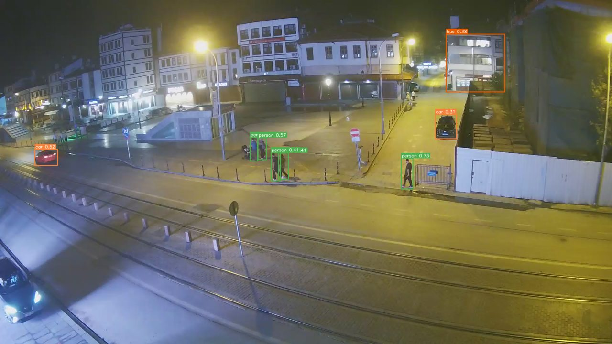
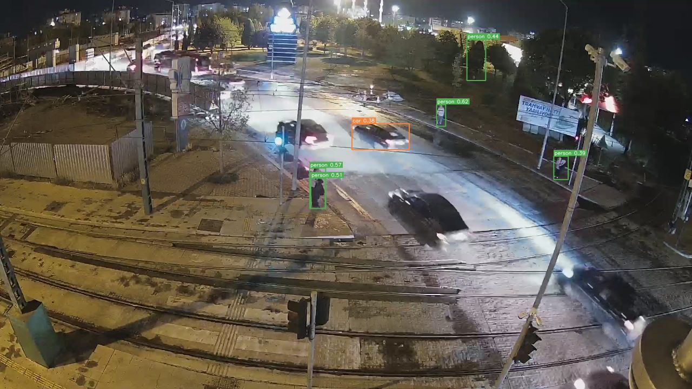
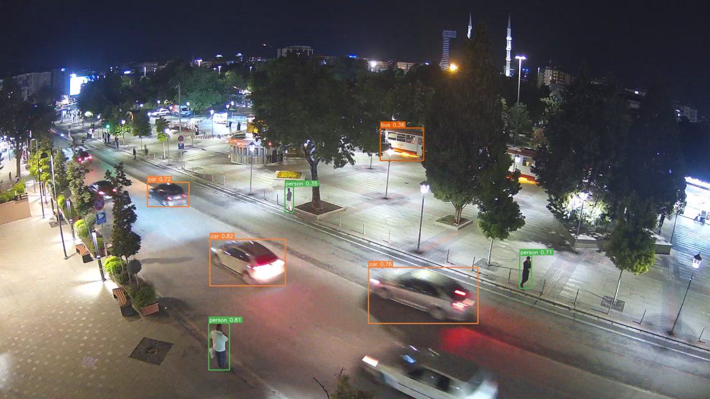
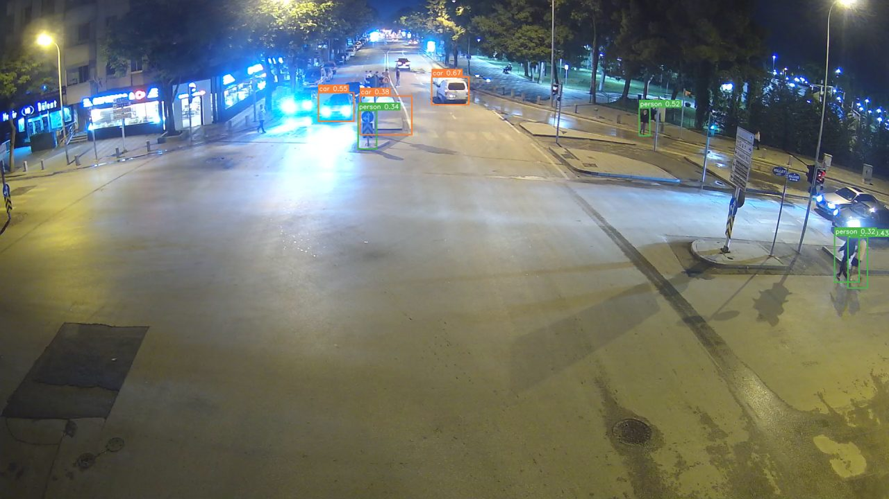

# Business Activity - Live Footfall

Turn public live-stream street cameras (Turkey, Thailand, Japan, USA) into
quantitative time series:

> **live HLS stream -> yolov8s frame inference -> counts + appearance re-ID -> Firestore ->
> real-time web dashboard.**

The project samples 4 street cameras per sampling round (40 s in the shipped
cloud deployment; `--interval` sets it), runs yolov8s on each frame, writes the
counts and a per-detection appearance signature to Firestore, and pushes the
result to a browser dashboard via `onSnapshot`. The video tiles are live
streams while the numbers describe the most recent sample, so each tile also
shows the age of its counts ("counts from 38s ago"); the label goes red when
the collector is not keeping up.

> All source, configs and the notebook live in [`src/`](src/). The repo root only carries this `README.md`, the notebook, and the gitignore.

---

## What the model sees

Live frames from the four grid cameras, annotated by the exact pipeline the
collector runs (`yolov8s`, `imgsz 640` on the shipped systemd unit,
`conf 0.30`): green boxes are people, orange are vehicles, magenta is a train,
each with its confidence. The dashboard shows this view live under every tile
("Model view"), refreshed with every sample, including night scenes.

| Konya - Hukumet Meydani | Konya - Otogar Kavsagi |
|---|---|
|  |  |
| **Konya - Kulturpark** | **Konya - Millet Caddesi** |
|  |  |

---

## What the program does, end to end

```
 +-----------------------+    +------------------------+    +--------------------+
 |  Live cameras         |    |  Cloud collector       |    |  Firebase          |
 |  (TR: IBB + Konya;    | -> |  GCP e2-micro VM       | -> |  Firestore (24h TTL)|
 |   TH/JP/US: YouTube)  |    |  * country ladder grid |    |   footfall/{auto}   |
 |                       |    |  * yolov8s predict     |    |   latest/{slot_id}  |
 |                       |    |  * appearance re-ID    |    |   reid_stats/{slot} |
 |                       |    |  * anomaly gates       |    |   config/grid       |
 |                       |    |  * Storage snapshots   |    |  Storage (24h)      |
 +-----------------------+    +------------------------+    +----------+---------+
                                                                       | onSnapshot
                                                                       v
                                           +----------------------------------------+
                                           |  web/  static HTML dashboard            |
                                           |  * 4-slot grid with active-cam badge   |
                                           |  * per-tile mini chart + anomaly       |
                                           |  * combined 24 h chart                  |
                                           |  * re-ID summary table                  |
                                           +----------------------------------------+
```

The two halves are decoupled. The collector runs 24/7 on a GCP `e2-micro`
on the Always Free tier ($0/month); the deploy README documents its
measured memory sizing. The dashboard is plain HTML/JS; anyone can serve
`web/` and subscribe to the live data. Firestore's TTL policy prunes the last
24h to keep the DB small. Anomaly and returning-visitor snapshots go to
Firebase Storage (also 24h lifecycle).

The grid is **country-generic**. It always runs **4 cameras from ONE country**
and rotates through a country priority ladder: **Turkey -> Thailand -> Japan
-> USA**, falling through to the next country only when the active one goes
fully dark. Turkey is the project's subject (Istanbul IBB first, then Konya);
since IBB is geo-blocked from Google Cloud, from the VM the grid usually falls
through to the foreign benches (YouTube-Live-backed street/traffic cameras
that are not geo-blocked). A few minutes before each daily report the collector
re-probes higher-priority countries so Turkey reclaims the grid the moment it
comes back.

Inside a country, a `CameraPool` walks that country's own ladder: every round
runs the first 4 healthy cameras (always distinct); a camera that misses 3
samples in a row rests 15 min and the grid backfills from deeper in the SAME
country's bench; `tvkur` (Konya) cameras are fast-fail probes that rest after
a single miss. A `HostBreaker` rests a whole host for 20 min after 4
consecutive access refusals (HTTP 403/429) and reopens it with a single probe.
Each assignment change updates `config/grid` (with the active `country`); the
dashboard re-renders that tile with the new active cam.

Report fields follow the live country and camera: the day/night gate uses
each **camera's** timezone (the US bench alone spans Eastern, Central and
Pacific).

---

## Quick start

The project ships zero-config for **viewers**: the Firebase Web SDK identifier
is committed, Firestore Rules make the four public collections read-only, the
cloud collector is running, and the dashboard just lights up.

```bash
# Anyone who clones the repo
pip install -r src/requirements.txt
cd src && python serve.py                    # opens http://localhost:8000 with live counts
```

Cloud deployment (for the maintainer only, requires a Firebase Admin
service-account key), disaster recovery, VM commands, health-check battery,
Firebase setup, the Cloudflare Worker for IBB, and the GCP billing
kill-switch all live in one consolidated guide:

- English: [`src/docs/PROJECT_GUIDE.md`](src/docs/PROJECT_GUIDE.md)
- Hebrew (verbose, RTL): [`src/docs/PROJECT_GUIDE_HE.md`](src/docs/PROJECT_GUIDE_HE.md)

**Connecting to the collector VM** (`turkey-collector`, zone `us-east1-c`,
project `turkey-footfall`): Console -> Compute Engine -> the **SSH** button,
or from your own machine:

```bash
gcloud compute ssh turkey-collector --zone=us-east1-c
```

The guide's [health-check battery](src/docs/PROJECT_GUIDE.md#45-health-check-battery--is-the-vm-really-feeding-the-report)
(service status, live sampling, memory, and an end-to-end "grab a real
Turkey frame now" test) is the fastest way to confirm the collector before
trusting any report. The VM is disposable by design; the
[rebuild-from-zero](src/docs/PROJECT_GUIDE.md#48-full-rebuild-from-zero)
recipe covers both a GCP-identical machine and any other Linux provider,
including the re-mint path for every secret.

`serve.py` is a no-cache static server that binds `web/` on port 8000
(override with `--port`, suppress the browser pop with `--no-browser`,
auto-falls-back to the next free port if 8000 is busy).

---

## What the model predicts

The 24/7 cloud collector runs **`yolov8s`** at `imgsz 640`, pinned in the
shipped systemd unit
([`--weights yolov8s.pt --imgsz 640`](src/deploy/gcp-vm/collector.service)).
Change via `--weights` (collector); `ultralytics` auto-downloads the weights
on first use. The nano fallback (`yolov8n.pt`) is documented in the systemd
unit's comments for memory-pressure scenarios.

Each call returns boxes + class ids + confidences for the **COCO classes the
project cares about** ([`CLASSES_OF_INTEREST`](src/app/detect_core.py:111)):

| COCO id | name        | role                                       |
|:-------:|-------------|--------------------------------------------|
| 0       | `person`    | the primary footfall signal                |
| 1       | `bicycle`   | vehicle bucket                             |
| 2       | `car`       | vehicle bucket                             |
| 3       | `motorcycle`| vehicle bucket                             |
| 5       | `bus`       | vehicle bucket                             |
| 6       | `train`     | rail traffic (separate bucket, not summed into vehicles) |
| 7       | `truck`     | vehicle bucket                             |

`detect_with_boxes(frame, conf, imgsz)` returns:

```python
counts = {
    "person": 23, "car": 4, "bus": 0, "truck": 1,
    "bicycle": 0, "motorcycle": 2, "train": 0,
    "vehicles": 7,   # sum of the ROAD vehicle classes (train is separate)
}
boxes = [{"x1": ..., "y1": ..., "x2": ..., "y2": ..., "cls": "person", "conf": 0.71}, ...]
```

**Burst-median sampling.** Each sampling round grabs a short burst (default 2
frames ~0.5 s apart on the VM), detects on every frame, and keeps the
**median** count per class ([`grab_burst` / `detect_burst`](src/app/detect_core.py)).
Re-ID and snapshots use the frame whose count matches the median, so images
and numbers stay consistent. The raw per-frame series is kept on each doc
(`burst`) for transparency.

**Input size + confidence.** `detect_core.DEFAULT_IMGSZ` is `960`. The shipped
systemd unit for the Always Free e2-micro (1 GB) pins `--imgsz 640` for RSS
headroom (with the OSNet re-ID embedder loaded). Raise `--imgsz` on any host
with more RAM (e2-small = 2 GB and up) to recover distant-object recall.
Default confidence is `--conf 0.30`, with per-class overrides in
[`DEFAULT_PER_CLASS_CONF`](src/app/detect_core.py:1235): `person` is 0.35 to
stop low-confidence "traffic sign labeled as person" mis-fires. Any camera
can carry its own calibrated `"conf"` override in
[`cameras.py`](src/app/cameras.py).

**Static false-positive gates.** Two shape/aspect gates plus a per-camera
polygon opt-out shave off classes of mis-detection that a confidence
threshold alone cannot kill:

- `DEFAULT_PERSON_MIN_ASPECT = 0.90` drops person boxes shorter than they
  are wide (strollers, banners, low road furniture).
- `DEFAULT_PERSON_MAX_ASPECT = 3.0` drops person boxes far taller than they
  are wide (lamp posts, thin bollards, some traffic signs).
- A camera dict can name per-class exclude polygons:
  `cam["roi_exclude_class"] = {"person": [poly, ...]}` says "in this zone,
  never accept a `person`", without hiding cars/trains that legitimately
  cross the same pixels. Foot-point-inside test, same as the existing `roi` /
  `roi_exclude`.

Per sampling round the collector writes:

- **`footfall/{auto-id}`**: append-only history doc:
  `{ts, slot, cam_id, cam_name, person, vehicles, counts, burst, is_night,
  crossings?, ok, is_anomaly, anomaly?, new_entities, seen_entities,
  expire_at}`. Powers the 24 h charts, the anomaly badges and the events
  table. `expire_at` is 24h ahead; Firestore's TTL policy auto-deletes
  expired docs.
- **`events/{auto-id}`**: operational events (`loiter`, `returning`) with
  snapshot URLs; same 24h TTL model (set the TTL policy on
  `events.expire_at`). Powers the dashboard's "Operational events" table and
  the alert pushes.
- **`latest/{slot_id}`**: overwritten each sample. Powers the "now" KPI tiles
  cheaply (one doc per slot, not a full history scan). Contains the current
  `cam_id` so the dashboard can label the tile with which cam is active
  right now.
- **`reid_stats/{slot_id}`**: overwritten each sample with the
  appearance-registry rollup for the currently-active camera in that slot.
- **`config/grid`**: one document, updated whenever a slot switches cameras.
  Lists the active_cam / embed URL / display area for each of the 4 slots.
  The dashboard subscribes to this and re-renders when a fallback happens.

### Anomaly detection - operational scene gates

The collector, not the browser, decides what is anomalous; the dashboard
renders its verdicts verbatim (`is_anomaly` + the `anomaly` map on each
doc), so the badge, the events table and the snapshots always agree. An
anomaly is an OPERATIONAL event:

- **`extreme_load`**: >= 50 people, or a weighted vehicle load >= 38 (car 1,
  truck/bus 2.5, train 3, motorcycle 0.5, bicycle 0.3);
- **`camera_obstructed`**: one detection covering >= 50% of the frame at
  confidence >= 0.45 (the confidence gate keeps a low-conf hallucination
  from "obstructing" the camera);
- **`camera_dark`**: mean luma collapsing from >= 90 to <= 25 (feed died or
  lens covered; distinct from ordinary nightfall, which the day/night gate
  handles).

Each (camera, kind) pair cools down for 30 minutes between verdicts, and the
collector warns loudly when a camera exceeds 8 verdicts a day. Every verdict
carries `observed` vs `expected`, and each event saves a raw + annotated
snapshot (drawn from the detections already computed, no second model pass).
Loitering and returning-visitor detections flow through the same `events`
feed as their own kinds.

### The full decision logic

Values below are the shipped defaults; the CLI flags / `cameras.py` keys
named in each table override them.

**Stage 0 - what a "sample" is.** Every round (`--interval`, 40 s shipped)
and per camera: resolve the stream -> grab a burst of frames (`--burst 2`
shipped, ~0.5 s apart at the stream's measured fps) -> yolov8s at `imgsz 640`
(systemd unit) or `960` (larger hosts); a camera entry may override with its
own `"imgsz"` key (the far wide-angle Sarachane cam runs at 960 on the VM
while the rest stay at 640). Confidence >= 0.30 with
`person`/`car`/`bus`/`train`/`truck` re-tightened to 0.35 and the
person-shape gate active. COCO classes person/bicycle/car/motorcycle/bus/
train/truck -> optional ROI + per-class exclude filters (below) -> the
reported count per class is the **median across the burst** -> `vehicles` =
sum of the road-vehicle classes (`train` stays separate). The representative
frame (person count closest to the median) feeds re-ID and snapshots. Every
sample also gets an `is_night` tag (mean gray < 60).

**Stage 0.5 - ROI filter** (only when the camera defines `"roi"` /
`"roi_exclude"` polygons): a detection exists only if its **foot point**
(bottom-center of the box) is inside the include-polygon and outside every
exclude-polygon. Everything downstream (counts, anomalies, re-ID, loitering)
sees only ROI-passing detections.

**Layer 1 - scene anomalies.** Evaluated on every successful sample by
`check_scene_anomalies`, all thresholds hard operational gates:

| kind | fires when | default |
|---|---|---|
| `extreme_load` | people >= 50, or weighted vehicle load >= 38 (car 1, truck/bus 2.5, train 3, motorcycle 0.5, bicycle 0.3) | `PERSON_EXTREME`, `VEHICLE_LOAD_EXTREME` |
| `camera_obstructed` | one box covers >= 50% of the frame at conf >= 0.45 | `OBSTRUCT_AREA_FRAC`, `OBSTRUCT_MIN_CONF` |
| `camera_dark` | mean luma falls from >= 90 to <= 25 between samples | `DARK_FROM`, `DARK_TO` |

Each (camera, kind) cools down 30 minutes; more than 8 verdicts per camera
per day triggers a miscalibration warning in the log.

**Layer 3 - returning visitor (came back to the scene).** Person-only: for
every re-ID match, a saved return event requires ALL of, in order: class
`person` with box height >= 64 px (embeddings of smaller crops are upscaling
noise) -> not a new entity -> has a previous sighting -> absence >= **5 min**
(`--returning-gap-min`) -> match similarity >= 0.92 (OSNet person floor;
0.96 histogram) -> >= 2 prior sightings -> the camera was actually SAMPLED
during >= 50% of the absence (an outage/fallback blind spot is not a
departure; observation log seeded from Firestore history on restart) -> the
entity re-appeared AWAY from its previous position (IoU < 0.35) -> >= 30 min
since this entity's last saved return. Passing all => crop + full-frame
snapshot, an `events` doc, and an alert push. Each (camera, kind) is capped
at 10 events/day; the counters persist to disk AND are rebuilt from
Firestore's own `events` on startup.

**Layer 4 - prolonged presence / loitering.** A stay = consecutive re-ID
matches of the same entity whose boxes overlap (IoU >= 0.3) with no gap
longer than 3 min. When a stay exceeds **5 min for a person / 15 min for a
vehicle** (`--loiter-*-min`, per-camera `loiter_person_sec` /
`loiter_vehicle_sec`), with the foot point inside `loiter_roi` when one is
set => `loiter` event with crop snapshot + alert; the same entity re-alerts
at most every 30 min.

**Layer 5 - line crossings (sampled flow).** Cameras with a `"line"`: within
each burst, detections are linked across frames by nearest centroid (move
budget 12% of the frame diagonal, class must match); a track whose foot
point changes sides of the line counts as one crossing, split in/out (sign
of the cross product vs the A->B direction) and person/vehicles. The burst
observes ~2-3 s out of every 40 s, so these are a **sampled rate**:
trend-comparable on the same camera over time, not a turnstile total. Two
Konya cameras ship with calibrated lines (`konya_millet_caddesi` across the
junction mouth, `otogar_kavsagi` across the diagonal road axis); the
dashboard renders each tile's in/out the moment the field appears.
`tools/roi_grid.py` overlays the normalized grid on any camera's frame when
you calibrate your own.

**Re-ID accumulators.** Per detection: crop -> embedder -> unit vector ->
cosine vs the <= 400 most-recently-seen same-camera same-class entities
(SQLite) minus entities already matched in this frame -> best >= threshold
(0.92 histogram / 0.65 OSNet) = same entity: sightings += 1, `last_seen`
updated, stored vector drifts toward the new look
(`0.75*old + 0.25*new`, skipped when similarity >= 0.995); otherwise a new
entity row. Entities idle 48 h are pruned. The registry stores which
embedder produced its vectors and resets itself if the embedder changes.

**Aggregates computed on top**: per-sample record fields: `person`,
`vehicles`, `counts` (per class), `burst` (raw per-frame series),
`is_night`, `crossings`, `new_entities`/`seen_entities`, `is_anomaly` +
`anomaly`, snapshot URLs. Dashboard-side (from the last 24 h of records):
avg and peak people; **activity index 0-10** = now / 90th-percentile of the
24 h series, x8, clamped (Quiet <= 2 < Moderate <= 5 < Busy <= 7 < Crowded);
anomaly count per tile. Collector-side: anomalies per camera per Turkey-local
day; crossing **8/day** prints a miscalibration warning; alert pushes are
capped at one per (kind, camera) per 10 min and 20/hour globally.

### Operational events + alert push

`loiter` and `returning` events land in the `events` Firestore collection
(24 h TTL, rendered in the dashboard's "Operational events" table with
snapshot links) and are pushed, with the image, via **Telegram**
(`TELEGRAM_BOT_TOKEN` + `TELEGRAM_CHAT_ID`) and/or a **generic webhook**
(`ALERT_WEBHOOK_URL`, JSON with optional base64 image; feed it to
Slack/Discord/n8n). Confirmed anomalies push too, with the annotated
snapshot. Rate limits above; `--no-alerts` / `--no-loiter` switch the
features off. Push failures never interrupt sampling.

### Re-identification

Implemented in [`app/reid.py`](src/app/reid.py) with a **pluggable embedder**
([`app/reid_embed.py`](src/app/reid_embed.py)):

- **Default: HSV histogram** (dependency-free). Crop each detection
  (`64x128` persons, `96x96` vehicles), HSV-convert, mask very dark pixels
  (V<30), build an `8x8x8` color histogram + `[aspect_ratio, area]`,
  L2-normalize -> 514-d unit vector.
- **Upgrade: OSNet via ONNX** - a re-ID CNN that survives lighting and
  pose change. Produce the `.onnx` once on any machine with internet (any
  torchreid export path works), copy to the VM, run with
  `--reid-model data/osnet_x0_25.onnx` (~5-10 ms/crop on CPU via
  onnxruntime). Match threshold drops to the embedder's own default (0.65)
  automatically; the registry detects the embedder switch and resets itself.

Matching (either embedder): cosine against the same camera x same class
entities in SQLite (`data/reid.db`); best >= threshold bumps `sightings`
and EMA-drifts the stored embedding toward the fresh look; otherwise a new
entity is inserted. Two detections in one frame can never match the same
entity.

**Returning-visitor events** (the saved snapshot pairs under
`snapshots/returning/`) are person-only and require ALL of: class `person`
at box height >= 64 px, absence >= 5 min (`--returning-gap-min`), similarity
>= 0.92 (OSNet person floor; 0.96 histogram), >= 2 prior sightings, a 30-min
per-entity cooldown, a 10/day per-camera budget that survives restarts
(disk snapshot + rebuild from Firestore `events`), and two authenticity
guards: the camera must have actually been sampled during most of the
absence, and the entity must re-appear away from its previous position.

Dashboard-surfaced metrics: per-camera **unique entities**, **total
sightings**, and **regulars** (entities seen >= 3 times), labeled as an
**appearance-based estimate**. Two people in similar clothing can merge;
the same person can split after a hard lighting change (EMA drift helps
with gradual change only). The registry is pruned of entities not seen for
48 h (on startup + every 6 h) so counts describe the recent crowd. Swap
`embed_crop()` for OSNet when you need production accuracy; the SQLite
registry stays the same.

### Stream resolution

Cameras come in several `kind`s; [`resolve_stream`](src/app/detect_core.py)
routes each one through the right resolver:

| kind          | example                          | how it's resolved              |
|---------------|----------------------------------|--------------------------------|
| `hls`         | IBB livestream `.m3u8`           | used as-is                     |
| `youtube`     | YouTube Live page                | `yt-dlp` -> HLS                |
| `skyline`     | skylinewebcams.com page          | scrape rotating HLS token      |
| `webcamera24` | webcamera24.com page             | pull embedded tvkur player id  |

Some HLS hosts (`content.tvkur.com`, `livestream.ibb.gov.tr`,
`skylinewebcams.com`) require `Referer` / `Origin` headers that
`cv2.VideoCapture` cannot set on Windows; for those the collector downloads
the latest `.ts` segment manually with the right headers and decodes locally
([`_grab_via_segment`](src/app/detect_core.py)).

---

## The dashboard (`web/`)

Pure static page, no build step. Module ES imports, Firebase web SDK v10,
Chart.js 4. Opens with [`python serve.py`](src/serve.py) and renders:

- **2x2 camera grid**: each tile has a live iframe (tvkur player or a
  corsproxy.io-wrapped page for hosts with strict `X-Frame-Options`), a
  **Model view** (the collector's annotated frame with people green,
  vehicles orange, refreshed every sample), four KPIs (people now, vehicles
  now, 24 h average, 24 h peak), a ticking **"counts from Ns ago"** age
  label (red when > 120 s), an anomaly badge showing the collector's latest
  verdict (which metric, observed vs expected), and a per-tile mini chart
  of the last 30 samples with anomalous points enlarged in red on the
  series that fired.
- **Heat depth on the model strip**: each strip cell's toggle swaps to the
  camera's dwell heatmap; on the private dashboard two selectors pick the
  **layer (people / vehicles / other) x daypart (all day / night / morning
  / afternoon / evening)** combination, rendered on demand by
  `/api/heatmap` from the grid state the collector publishes next to its
  overlay (`snapshots/heatmaps/<cam>.json`). The public copy keeps the
  single published person overlay.
- **Combined 24 h chart** stacking all four cameras' people series.
- **Anomaly events table**: every flagged sample of the last 24 h across
  all slots: when, where, which metric, observed vs expected, and a link
  to the saved snapshot.
- **Re-ID summary table**: unique entities / total sightings / regulars per
  cam, tagged as an appearance-based estimate.
- **Status pill** in the header: `live` when every camera reported within
  120 s, `partial` if some are stale, `down` if Firestore has no recent
  writes.

Connection state is `connection refused` when nothing is bound to port 8000
(the role of [`serve.py`](src/serve.py)). The dashboard itself does not
open any port; it talks to Firestore from the browser tab.

---

## Search (image similarity + class/time browse)

Search the saved snapshot corpus produced by the VM collector, either by
uploading a reference photo, by picking a class and time range, or both:

- **UI**: the "Search" panel on the main dashboard. Three inputs, all
  optional and freely combinable:
  1. reference photo (drop zone): similarity match by YOLO + embedder;
  2. class chips (person / car / truck / bus / motorcycle / bicycle /
     train, multi-select, "any" = pick nothing);
  3. from/to datetime + count field, with 1h/24h/7d presets and a
     Loose/Balanced/Strict strictness switch that maps to `min_sim`.
  The "New search" button clears the panel.
- **API**: `POST /api/search` - image mode when the body is non-empty (rank
  by cosine similarity), browse mode when the body is empty (list crops by
  filter, ordered by time). Query params: `top`, `min_sim`, `classes`,
  `from`, `to`, `order`. `POST /api/visual-search` is kept as a
  backwards-compatible alias for the older image-only shape.
- **CLI**: `python -m tools.search_by_image --query photo.jpg`. Before the
  collector has accumulated real snapshots you can seed a demo index from
  still images: `--seed-images "docs/images/*.jpg"`.

The query image goes through the same YOLO detection the collector runs
(each detected person/vehicle becomes a query object; an already-cropped
photo falls back to whole-image), each crop is embedded with the same
pluggable re-ID embedder (`app/reid_embed.py`), and the embedding is
cosine-matched against the saved snapshot crops (embeddings cached in
`web/snapshots/.search_cache.json`) and the `data/reid.db` entities. A hit
above the embedder's own matching threshold is labeled a **match**;
everything else is ranked "similar". The registry refuses to compare across
embedders.

The default HSV-histogram embedder finds *the same-looking object* (color
+ build) under similar lighting; it does not do semantic "person with a red
hat" search. Point `REID_MODEL` at an OSNet `.onnx` for lighting/pose-robust
matching. Env knobs: `REID_MODEL`, `REID_DB`, `SEARCH_YOLO` (YOLO weights
for query parsing, `off` to disable).

---

## Review detections - human in the loop

YOLOv8 is inference-only at runtime; it does not learn from the live stream.
The Review panel on the dashboard is the feedback loop:

- **UI**: the "Review detections" section on the dashboard picks one saved
  crop the user has not reviewed yet, shows it next to the model's label,
  and offers three verdicts: `correct`, `wrong label` (with a select for
  the right class), `not an object`. An optional free-form note is stored
  alongside. Submitting fetches the next crop.
- **API**: `GET /api/review-sample`, `POST /api/review-submit`,
  `GET /api/review-stats`. Storage is a plain JSON file at
  [`data/reviews.json`](src/data): thread-safe, atomic rewrite per submit,
  no new DB dependency.
- **Downstream** ([`app/labels.py`](src/app/labels.py)):
  `ReviewStore.rejects_for_cls("person")` returns the crop paths a user
  flagged as `wrong_label` or `not_an_object` for that class: the input to
  hand-crafting the per-camera `roi_exclude_class` polygons, or to
  exporting a COCO-format fine-tuning dataset.

**Full-frame review UX (canvas)** - the shipped default. The panel loads
one saved frame at a time and draws every detection as a class-colored
rectangle over it. Click a box: grey -> green (correct) -> red (wrong) ->
grey. Switch to "add missing", pick a class, drag a rectangle around an
object the model failed to see: the **FN signal** that makes recall
computable. Verdicts land in `data/reviews.json::frame_reviews`, feed the
same confidence-boost + auto-blacklist pipes as the crop-level flow.

### Active-learning loop (labels -> fine-tuned head -> gated promotion)

Every verdict does double duty: instant heuristics and training.

1. **Uncertainty at capture**: the collector scores every stored box
   against the EFFECTIVE gates the burst ran with
   ([`app/uncertainty.py`](src/app/uncertainty.py)); the review queue
   serves the least-certain frames first, and the BADGE crop sampler
   (`REVIEW_SAMPLER=badge`) adds embedding-space diversity.
2. **Sync**: each submit ships verdicts + reviewed frames to Storage
   `training/` in the background
   ([`app/training_sync.py`](src/app/training_sync.py)).
3. **Train**: the `train-head` GitHub Actions workflow (manual Run workflow
   button; free public-repo runner) pulls the data, exports a chronological
   90/10 YOLO dataset, and fine-tunes ONLY the Detect head of **yolov8s**
   (the exact base the VM runs), backbone frozen, mosaic/mixup off,
   <= 10 epochs.
4. **Gate**: `tools/promote_adapter.py` validates base vs candidate on the
   same val split; promotion requires mAP50 +0.5pp AND no class dropping
   > 2pp (person/car: 0pp). Every run - promoted or rejected - lands in
   `history.jsonl` and mirrors to Firestore `training_events`.
5. **Deploy**: promoted heads publish to Storage; the collector polls every
   30 rounds and hot-swaps the Detect tensors in place (no restart).
   `--rollback` restores the previous head in one command.
6. **Calibrate**: `tools/calibrate_conf.py` distills the review confusion
   matrix into per-(camera, class) confidence gates at 0.90 precision
   (pairs with >= 30 verdicts), overriding the +/-0.015 heuristic nudge.
7. **Prove it**: the dashboard's "labels vs mAP50" chart (`/api/al-curve`)
   plots every training run: promoted in color, rejected greyed, baseline
   dashed.

**Model-quality scoreboard**: the header carries a live one-liner computed
from the review store:

    Model: 87% accuracy . P(person) 82% . P(car) 91% . R 74% . F1 79%
           . FP 13% . 312 reviews . tuned 5 classes

The line refreshes every 10 s. Recall and F1 appear once any frame review
has landed an FN (missed-detection); until then only precision and accuracy
are honest, and the line reflects that.

**OSNet upgrade (optional)**: the shipped default appearance embedder is
an HSV histogram. To upgrade to a semantic identity embedder (OSNet, ~5 MB
ONNX, ~5-10 ms per crop on CPU):

    bash tools/setup_reid.sh

The systemd unit already sets
`REID_MODEL=<install>/src/data/osnet_x0_25_msmt17.onnx`; when the file
exists both the collector and the dashboard server pick it up on their
next start (`reid_embed.make_embedder` degrades to the histogram
transparently when the file is absent). At the same time this raises the
search-similarity floor from 0.30 to 0.55 by default.

---

## Camera catalog

[`app/cameras.py`](src/app/cameras.py) is the source of truth. The four
cameras shipped in the dashboard grid (`GRID_CAMERAS`):

| id                       | name                                   | host         |
|--------------------------|----------------------------------------|--------------|
| `konya_hukumet`          | Konya - Hukumet / Sarraflar Yeralti    | tvkur        |
| `otogar_kavsagi`         | Konya - Otogar Kavsagi                 | tvkur        |
| `konya_kulturpark`       | Konya - Kulturpark                     | tvkur        |
| `konya_millet_caddesi`   | Konya - Millet / Hastane Kavsagi       | tvkur        |

IBB Istanbul streams (`taksim`, `kapali_carsi`, `misir_carsisi`,
`sultanahmet_1`, `kadikoy`, `eyup_sultan`, `uskudar`, `beyazit_meydan`) and
`giresun_gazi` (skylinewebcams) are in the catalog but **geo-restricted**
to a Turkey-routed IP. Run the collector from a Turkey VPN/VPS to populate
those tiles too. From any other network you will see `MISS` rows for them
and the dashboard will leave them blank.

Verifying a stream resolves on your network:

```bash
python -m app.detect_core --resolve konya_hukumet,otogar_kavsagi
```

---

## Operational notes

- **Storage**: Firestore free tier ~ 20 k writes/day. At the shipped
  `--interval 40` cadence with 4 slots x 2 writes/round the service uses
  ~17.3k/day of the 20k free budget. Raise `--interval`, batch, or ship
  `footfall` to BigQuery instead of keeping everything in Firestore.
- **VM sizing (measured)**: this project's `e2-micro` (1 GB, Always Free,
  $0) with `--weights yolov8s.pt --imgsz 640 --burst 2` sits at ~410 MB RSS
  with 96-100% CPU idle (load avg 0.03) under
  `MemoryHigh=760M`/`MemoryMax=900M`. Peaks vary by torch build; if a box
  shows reclaim-throttling (rounds of minutes, frozen dashboard numbers),
  drop to `--weights yolov8n.pt --imgsz 768` before touching anything else.
  If a round takes longer than `--interval` the collector logs it, and the
  effective tile refresh rate is the round time.
- **Calibration is not pre-baked**: absolute counts are consistent (same
  model, same gates) but uncalibrated. yolov8s undercounts dense/distant
  crowds; the anomaly layers compare the stream to itself, so relative
  verdicts survive that bias, absolute counts do not.
- **Privacy by design**: the collector stores **aggregate counts** (and an
  HSV histogram appearance hash for re-ID), never raw frames of people.
  Crops live in memory only and are dropped after embedding.
- **Scope**: only public, intentionally-public cameras (city tourism cams,
  official infrastructure feeds, market broadcasters). Cameras exposed to
  the internet without owner consent are explicitly out of scope.

---

## Repo map

| Path | Purpose |
|------|---------|
| [`turkey_business_activity_yolov8s.ipynb`](turkey_business_activity_yolov8s.ipynb) | The project notebook (lives at the repo root). |
| [`serve.py`](src/serve.py) | One-shot launcher for the dashboard (no-cache static server). |
| [`app/collector.py`](src/app/collector.py) | 24/7 sampler that writes to Firestore. |
| [`app/detect_core.py`](src/app/detect_core.py) | YOLO loading, stream resolution, detection, ROI filter, burst tracking + line crossings. |
| [`app/reid.py`](src/app/reid.py) | Appearance-based re-identification registry (SQLite). |
| [`app/reid_embed.py`](src/app/reid_embed.py) | Pluggable re-ID embedders: HSV histogram / OSNet ONNX. |
| [`app/visual_search.py`](src/app/visual_search.py) | Search-by-example: match an uploaded image against saved snapshots + the re-ID registry. |
| [`app/presence.py`](src/app/presence.py) | Prolonged-presence (loitering / parked) detection. |
| [`app/alerts.py`](src/app/alerts.py) | Telegram / webhook alert push with rate limiting. |
| [`app/cameras.py`](src/app/cameras.py) | Verified camera catalog + per-camera ROI/line/loiter config. |
| [`app/firebase_store.py`](src/app/firebase_store.py) | Firestore writer (`footfall` / `latest` / `reid_stats` / `events`). |
| [`tools/roi_grid.py`](src/tools/roi_grid.py) | Capture a frame with a coordinate grid to configure ROI/line polygons. |
| [`tools/search_by_image.py`](src/tools/search_by_image.py) | CLI for search-by-example (+ demo index seeding from still images). |
| [`web/`](src/web/) | Static HTML/JS dashboard. |
| [`docs/PROJECT_GUIDE.md`](src/docs/PROJECT_GUIDE.md) / [`PROJECT_GUIDE_HE.md`](src/docs/PROJECT_GUIDE_HE.md) | Single consolidated project guide (English + verbose Hebrew): architecture, VM setup + commands + rebuild, Firebase, Cloudflare proxy, billing kill-switch. |
